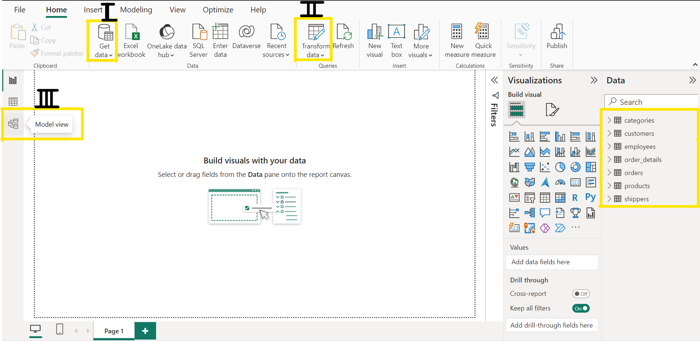
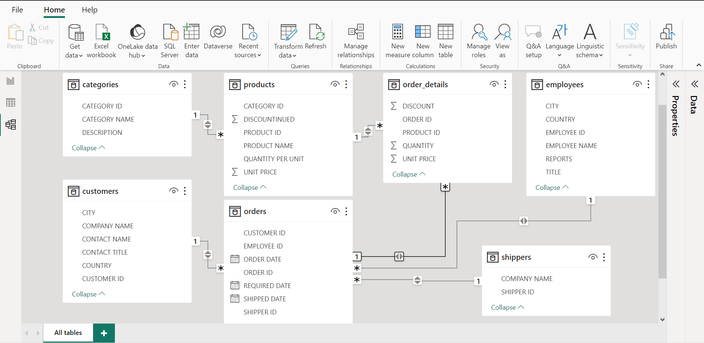
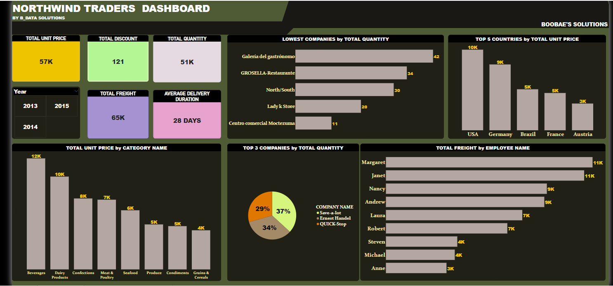

# NORTHWIND TRADERS DASHBOARD

## INTRODUCTION

In the ever-evolving realm of trading, the importance of well-informed decision-making cannot be overstated. Our mission is to empower traders with actionable insights and simplify their analytical workflows through the development of an advanced Tracking Dashboard. This dashboard is intricately designed, utilizing the extensive 'Northwind Traders' dataset, which encompasses seven diverse datasets, collectively painting a comprehensive picture of trading activities.

Our primary objective is to equip traders with a potent tool that transcends raw data, converting it into actionable intelligence. The Tracking Dashboard is geared towards providing a holistic perspective on key performance indicators (KPIs), crucial for strategic analysis and offering a thorough overview of trading performance. Beyond this, the dashboard aims to delve deeper into trading dynamics, uncovering insights such as identifying underperforming companies based on total quantity traded, spotlighting the top 5 countries ranked by total unit price, etc.

The Tracking Dashboard is a testament to our unwavering commitment to delivering a robust and user-friendly solution, fostering informed decision-making within the intricate landscape of trading.

## PROBLEM STATEMENT

1. Generate five (5) key performance indicators (KPIs) comprising:
   - Total Unit Price
   - Total Discount
   - Total Quantity
   - Total Freight
   - Average Delivery Duration

2. Identify and highlight companies with the lowest total quantity traded
3. Determine and showcase the top five(5) countries based on total unit price
4. Ascertain the total unit prices by category name
5. Highlight the top three (3) companies with the highest total quantity traded
6. Illustrate the distribution of total Freight costs by Employee Name
7. Integrate a dynamic "Year Slicer" for data filtering based on specific years.

This comprehensive outline aims to address key problem statements and guide the development of an effective tracking dashboard for traders using the 'Northwind Traders' dataset.

## SKILLS AND CONCEPTS DEMONSTRATED

In creating a tracking dashboard for traders using Power BI with the 'Northwind Traders' dataset, several skills and concepts need to be demonstrated. Here is a breakdown of the essential skills and concepts:

- Data Import and Transformation
- Data Modeling
- Visualization Techniques
- KPI Creation Utilizing DAX (Data Analysis Expressions)
- Data Aggregation and Calculation
- Hierarchical Analysis: Demonstrate the ability to analyze data hierarchically, such as by category name or employee name
- Dashboard Interaction: Implement interactive features like slicers, filters, and drill-through actions to enhance user control.
- Documentation and Presentation

By effectively demonstrating these skills and concepts, the Power BI dashboard will serve as a powerful tool for traders, providing actionable insights and facilitating informed decision-making in the trading domain.

## DEVELOPING THE NORTHWIND TRADERS DASHBOARD: STEPS, ANALYSIS, AND DISCUSSIONS

- Step 1 - Data Importation:
  ---

  Import the 'Northwind Traders' dataset, consisting of seven distinct datasets, into Power BI Desktop by adhering to the prescribed steps outlined in my work titled "Power BI Task 1: Data Integration".[Access the document here](https://github.com/Boobae-Vivian/POWER-BI-TASK-1-Dataset-Integration). As a result of this process, you will observe the presence of seven(7) datasets—categories, customers, employees, order_details, orders, products, and shippers—in the data pane within the Power BI environment. These datasets will be highlighted by a yellow line, as depicted in the snapshot below.

- Step 2 - Data Cleaning and Transformation:
  ---

  Kindly note that the imported datasets underwent data cleaning; however, unfortunately, snapshots were not taken during the cleaning process of the seven datasets. Nevertheless, it's important to note that a separate task focused on data cleaning, using an employee CSV dataset, has been completed. This task is extensively documented in my work on data cleaning and transformation, specifically detailed in Power BI Task 2. [View Here](https://github.com/Boobae-Vivian/POWER-BI-TASK-2-Data-Cleaning)

- Step 3 - Data Modelling:
  ---

  Data modeling stands out as a key functionality within the Power BI tool, facilitating the linkage of multiple data sources through the establishment of relationships. These relationships define the connections between various data sources, and our objective is to construct a robust data model that effectively captures the interconnections among the seven distinct datasets within 'Northwind Traders.' Our aim is to create suitable relationships between tables, ensuring a seamless foundation for data analysis.

  In this context, the predominant relationship type is the "one-to-many" relationship. This type of relationship establishes a connection where one record in a table corresponds to multiple related records in another table. To achieve this, navigate to the model view icon on the left side of the Power BI environment. Typically, Power BI automatically detects and creates relationships. However, if these relationships are not automatically established, one can manually create them by linking or dragging a common column in one table to meet another common column in a different table.

  In my case, Power BI automatically created these relationships, but the initial arrangement was not intuitive. Therefore, I invested additional effort to reorganize the relationships, enhancing readability and understanding. The outcome of this rearrangement is presented in the snapshot provided in the output of step 3 below. Notably, the asterisk (*) in the snapshot denotes "many", indicating a one-to-many relationship.

  STEP 1,  STEP 2  and  STEP 3
  :-----------------------------:
  

   OUTPUT OF STEP 3
  :-----------------------:
  

- Step 4 - Canvas Background and Dashboard Name:
  ---

  To commence the dashboard development after modeling datasets and establishing relationships between tables, proceed by clicking on the report view icon situated on the left side of the Power BI environment. Upon navigating back to the canvas page, prior to selecting a visual to appear in the report canvas and dragging fields from the datapane into the visualization pane, the canvas is first edited by applying a green background color.

  To achieve this, access the visualization pane and click on the format page icon. Choose the canvas background option and select the green color for the background.

  Subsequently, provide a fitting name for the dashboard by inserting a textbox and typing in "**NORTHWIND TRADERS DASHBOARD**". Following this, further refine the appearance of the name by editing it to be suitable for a dashboard title. In my case, I enhanced the name by adding shapes to make it stand out, giving the shapes a black background. These adjustments can be made using the format page settings in the visualization pane.

- Step 5 - Problem Statement and Analysis:
  ---

   ### 1.  Generate five (5) key performance indicators (KPIs) comprising:

  - Total Unit Price
  - Total Discount
  - Total Quantity
  - Total Freight
  - Average Delivery Duration

     To display Key Performance Indicators (KPIs), choose visual cards from the visualization pane and place them on the canvas. Drag the unit price, discount, quantity, and campaign columns, along with the average delivery duration measure, from the data pane into the values field in the visualization pane individually. This results in **total unit price at 57 thousand, total discount at 121, total quantity at 51 thousand, total freight at 65 thousand, and average delivery duration at 28 days**.

    However, average delivery duration is not a column and requires calculation using Data Analysis Expressions (DAX). Begin by creating a new column named "datediff" and employ the DATEDIFF function in Power BI to calculate the difference between the "order_date" column and the "required_date" column. Then, use the new measure to calculate the average delivery duration. The snapshots for these processes were not captured, but a comprehensive project on Data Analysis Expressions has been documented [here](https://github.com/Boobae-Vivian/POWER-BI-TASK-4-Data-Analysis-Expression-DAX).

    Arrange the card visuals to an appropriate size and customize them further by clicking on each card visual. Navigate to the visualization pane, click on format page, and adjust the visual and general options. Under the visual option, use the callout value option to enhance figures by making them bold and increasing the font. Utilize the category label option to turn off the name below the figures in the card. For the general option, use the title option to provide a suitable name for each card visual, appearing above the figures. Assign distinct background colors to each visual, and make the title names white with a black background. Note that visual cards are suitable for presenting single aggregate values.

  ### 2. Identify and highlight companies with the lowest total quantity traded:

    To pinpoint and emphasize companies with the lowest total quantity traded, initiate the process by selecting a bar chart from the visualization pane and placing it on the canvas. Drag the quantity column from the data pane into the visualization pane, assigning it to the x-axis, and position the company column on the y-axis for the chosen graphical representation. The resulting bar chart illustrates **Centro Comercial Moctezuma** as the company with the lowest total quantity specifically at 11, out of the five companies presented as the lowest total quantity traded.

    For improved clarity, extraneous elements such as gridlines and unnecessary labels were removed using the format page option in the visualization pane. The graphical representation was given a dark-brown background, with the bars adopting an ash color, labels in yellow, and the title header styled in white against a black background, maintaining a simplistic and uncluttered design.

  ### 3. Determine and showcase the top five(5) countries based on total unit price:

    To identify and present the top 5 countries based on total unit price, begin by selecting the column chart from the visualization pane, placing it on the canvas. Drag the unit price column from the data pane into the value fields in the visualization pane under the y-axis, and place the countries column on the x-axis. Subsequently, move to the filters pane, select the countries, set it to the top 5, and apply the filters. The outcome of this analysis will be visually depicted on the column chart, with the United States of America emerging as the foremost country among the top five, boasting a total unit price of 10 thousand.

    To enhance clarity and remove distracting elements, such as gridlines and unnecessary labels, utilize the format page option in the visualization pane. The graphical representation is then configured with a dark-brown background, ash-colored bars, yellow background for labels, and a title name presented in white against a black background, maintaining a design that is simple and uncluttered.

  ### 4.  Ascertain the total unit prices by category name:

    To determine the total unit prices by category name, commence by choosing the column chart from the visualization pane and placing it on the canvas. Drag the unit price column from the data pane into the value fields in the visualization pane under the y-axis, and position the category column on the x-axis. The outcome of this analysis will be visually depicted on the column chart, with "Beverages" emerging as the foremost category with the highest total unit price of 12 thousand, and the "Grains and Cereals" category having the lowest total unit price of 4 thousand.

    To refine the graphical representation and eliminate distracting elements like gridlines and unnecessary labels, utilize the format page option in the visualization pane. The graphical depiction is then configured with a dark-brown background, ash-colored bars, yellow background for labels, and a title name presented in white against a black background, maintaining a design that is simple and uncluttered.
  
  ### 5. Highlight the top three (3) companies with the highest total quantity traded:

    To emphasize the top 3 countries with the highest total quantity traded, begin by selecting the pie chart from the visualization pane, placing it on the canvas. Drag the countries column from the data pane into the legend-axis, and the education column to the values axis since we are utilizing the pie chart. Subsequently, navigate to the filters pane and set the company to the top 3, applying the necessary filters.

    The outcome of this analysis will be visually depicted on the pie chart, showcasing Save-a-lot as the leading company with a total percentage of 37%, followed by Ernest Handel at 34%, and Quick Stop at 29%.

    To refine the graphical representation and remove distracting elements such as gridlines and unnecessary labels, utilize the format page option in the visualization pane. The graphical depiction is then configured with a dark-brown background, ash-colored bars, labels in yellow, and a title name presented in white against a black background, maintaining a design that is simple and uncluttered.

  ### 6. Illustrate the distribution of total Freight costs by Employee Name:

  To visualize the distribution of total freight costs by employee name, start by selecting the bar chart from the visualization pane and placing it on the canvas. Drag the freight column from the data pane into the visualization pane, assigning it to the x-axis, and position the employee column on the y-axis for the chosen graphical representation. The resulting bar chart illustrates **Margaret** as the employee with the highest total freight of 11 thousand, and **Anne** as the employee with the lowest total freight of 3 thousand.

  For improved clarity and to remove distracting elements such as gridlines and unnecessary labels, utilize the format page option in the visualization pane. The graphical representation is then configured with a dark-brown background, ash-colored bars, yellow background for labels, and a title header styled in white against a black background, maintaining a design that is simple and uncluttered.

   ### 7. Integrate a dynamic "Year Slicer" for data filtering based on specific years:

   To incorporate a dynamic "Year Slicer" feature into the dashboard, choose the slicer visual from the visualization pane to place it on the canvas. Subsequently, drag the year column from the data pane to the field option in the visualization pane.

  To edit or format the slicer, select it and navigate to the format page icon. Click on it and choose the slicer settings. Set the style option to "Title," giving it a table-like appearance. I configured it with a dark-brown background, and its title was styled with white text against a black background.

- Step 6 - Dashboard Result
  ---

  NORTHWIND TRADERS DASHBOARD
  :--------------------------:
  

## CONCLUSION

In conclusion, the development of the Northwind Traders Dashboard has provided a comprehensive tool for traders to analyze key performance indicators and make informed decisions. The integration of various datasets and the creation of relationships have laid the foundation for a robust data model. The visual representations of KPIs, company performance, and category insights offer valuable insights into trading activities.

Despite the success of the project, continuous improvement is essential. Regular updates, user training, and feedback mechanisms will contribute to the long-term success and usability of the dashboard. As the trading landscape evolves, the dashboard should be adaptable to changing needs and continue to serve as a valuable asset for traders seeking actionable insights.

